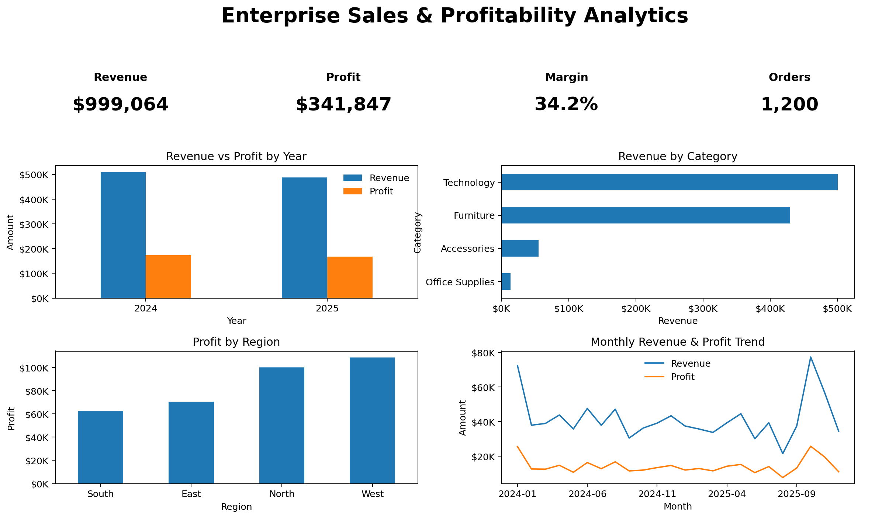
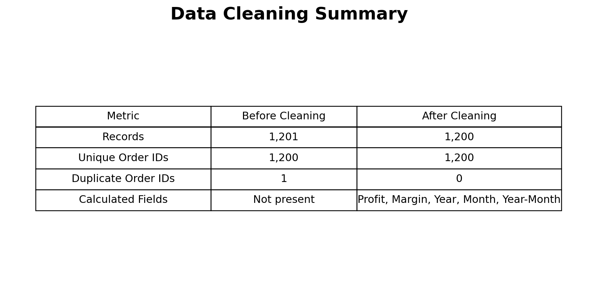
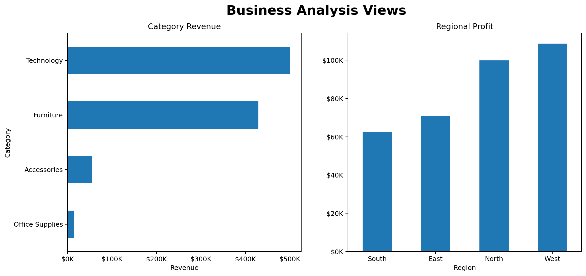

# 📊 Enterprise Sales & Profitability Analytics

> **A portfolio-ready data analytics project using Excel to transform transactional sales data into business insights.**



## 🎯 Project Overview

This project demonstrates an end-to-end data analytics workflow using a simulated enterprise sales dataset.

**Raw Data → Cleaning → Transformation → KPI Analysis → Business Analysis → Dashboard → Insights**

The goal is to answer practical business questions such as:

- How much revenue and profit did the business generate?
- Which categories and regions contribute the most?
- How is profitability changing over time?
- What is the overall profit margin?
- Which products generate the most revenue?
- How can discounts and profitability be monitored?

> **Dataset note:** The dataset is simulated for portfolio and learning purposes. It does not represent a real company's confidential data.

---

## 🧰 Tools & Skills Demonstrated

| Area | Skills |
|---|---|
| Spreadsheet Analytics | Microsoft Excel |
| Data Cleaning | Duplicate detection, validation, calculated fields |
| Data Analysis | KPI analysis, grouping, comparisons, trends |
| Excel Analytics | Pivot-style summaries, formulas, charts |
| Business Metrics | Revenue, COGS, Profit, Profit Margin, Orders |
| Visualization | KPI cards, charts, dashboard design |
| Data Preparation | CSV, structured tables, clean/raw separation |
| Supporting Skills | SQL and Python/Pandas analytical thinking |

---

## 📁 Repository Structure

```text
enterprise-sales-profitability-analytics/
│
├── 📊 Enterprise_Sales_Analytics_Dashboard.xlsx
├── 📄 README.md
│
├── data/
│   ├── raw/
│   │   └── enterprise_sales_raw.csv
│   └── clean/
│       └── enterprise_sales_clean.csv
│
├── screenshots/
│   ├── dashboard-overview.png
│   ├── business-analysis.png
│   └── data-cleaning.png
│
└── docs/
    └── INTERVIEW_PREPARATION_NOTES.md
```

---

## 📌 Dataset

The cleaned dataset contains **1,200 sales transactions** covering **2024–2025**.

### Main fields

- `Order_ID`
- `Order_Date`
- `Region`
- `Category`
- `Product`
- `Customer_ID`
- `Quantity`
- `Discount`
- `Revenue`
- `COGS`
- `Profit`
- `Profit_Margin`
- `Year`
- `Month`
- `Year_Month`

The raw dataset contains **1,201 records**, including one duplicate order record that was identified and removed during cleaning.

---

## 🧹 Data Cleaning

The project starts with raw transactional data and applies basic quality checks:

1. Checked for duplicate `Order_ID` values.
2. Removed the duplicate transaction.
3. Verified date fields.
4. Created calculated fields for `Profit` and `Profit_Margin`.
5. Created `Year`, `Month`, and `Year_Month` fields for time-based analysis.
6. Kept raw and cleaned datasets separately for traceability.



---

## 📈 Key KPIs

| KPI | Value |
|---|---:|
| Total Revenue | **$999,063.70** |
| Total COGS | **$657,216.35** |
| Total Profit | **$341,847.35** |
| Profit Margin | **34.22%** |
| Total Orders | **1,200** |
| Average Discount | **~10%** |

### Core formulas

```text
Profit = Revenue - COGS

Profit Margin = Profit / Revenue × 100
```

---

## 📊 Dashboard

The Excel workbook contains a dashboard with:

- KPI cards
- Revenue vs. Profit by year
- Revenue mix by category
- Category performance
- Regional performance
- Product analysis
- Monthly trend analysis



---

## 🔍 Business Analysis

The project analyzes performance across several business dimensions:

### By Year

Compare revenue, profit, orders and quantity over time.

### By Category

Identify high-revenue and high-profit categories.

### By Region

Compare regional sales and profitability.

### By Product

Identify products contributing strongly to revenue and quantity.

### By Time

Track monthly revenue and profit trends.

---

## 💡 Example Business Questions

This dashboard can support questions such as:

- Which category generates the highest revenue?
- Which region generates the most profit?
- How does profit compare with revenue?
- Are margins consistent across categories?
- Which products deserve closer attention?
- Are discounts potentially affecting profitability?

The purpose of the dashboard is to make these questions easier to investigate rather than simply displaying raw numbers.

---

## 🧠 What I Learned

Through this project, I practiced the complete analytics lifecycle:

- Preparing raw data
- Detecting and removing duplicate records
- Creating calculated metrics
- Understanding business KPIs
- Grouping and comparing data
- Building visualizations
- Designing a dashboard for non-technical users
- Communicating analytical findings clearly

---

## 🚀 Future Improvements

Possible next steps include:

- Build an interactive Power BI version
- Add month-over-month and year-over-year growth metrics
- Add customer segmentation
- Add discount-vs-profit-margin analysis
- Add interactive filters/slicers
- Connect the analysis to SQL
- Automate data refresh using Python

---

## 📎 Project Files

**Main workbook:** `Enterprise_Sales_Analytics_Dashboard.xlsx`

The workbook includes:

- Dashboard
- Raw Data
- Clean Data
- Analysis tables
- Presentation guide

---

## 👩‍💻 Author

**Ananya Gupta**  
BCA — Big Data Analytics

### Areas of interest

`Data Analytics` · `Python` · `SQL` · `Excel` · `Power BI` · `Machine Learning`

---

⭐ If you find this project useful, feel free to explore the workbook and datasets.
